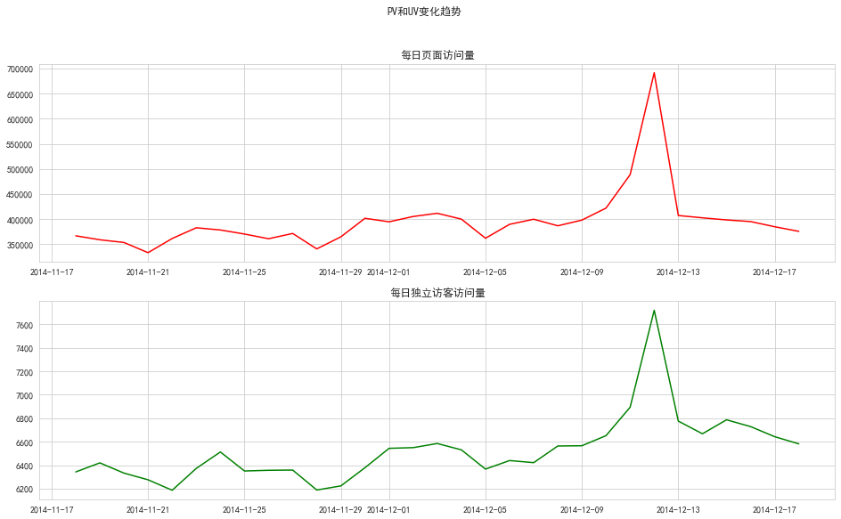
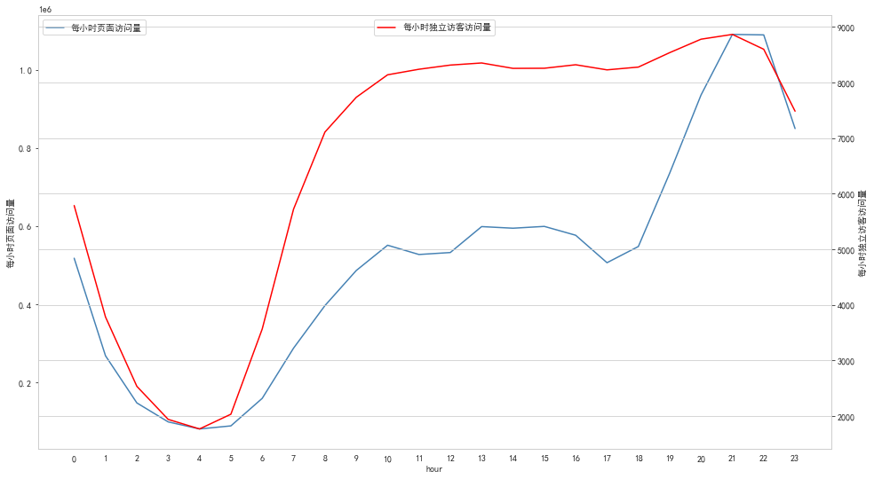
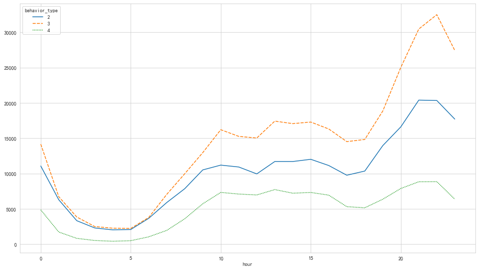
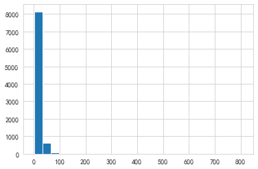
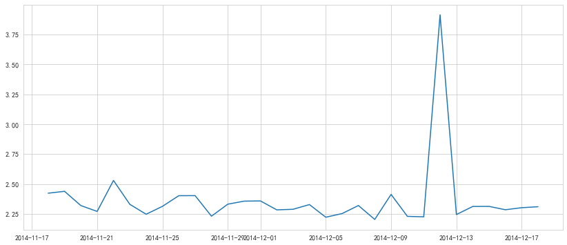
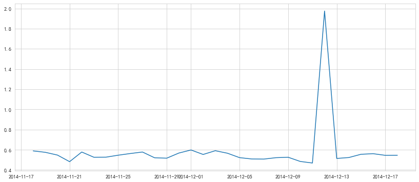
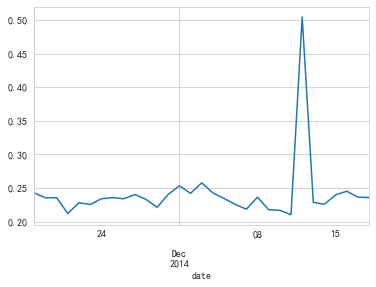

<h1>Table of Contents<span class="tocSkip"></span></h1>
<div class="toc"><ul class="toc-item"><li><span><a href="#读取数据" data-toc-modified-id="读取数据-1"><span class="toc-item-num">1&nbsp;&nbsp;</span>读取数据</a></span></li><li><span><a href="#数据预处理" data-toc-modified-id="数据预处理-2"><span class="toc-item-num">2&nbsp;&nbsp;</span>数据预处理</a></span></li><li><span><a href="#模型分析" data-toc-modified-id="模型分析-3"><span class="toc-item-num">3&nbsp;&nbsp;</span>模型分析</a></span><ul class="toc-item"><li><span><a href="#用户行为分析" data-toc-modified-id="用户行为分析-3.1"><span class="toc-item-num">3.1&nbsp;&nbsp;</span>用户行为分析</a></span></li><li><span><a href="#用户消费行为分析" data-toc-modified-id="用户消费行为分析-3.2"><span class="toc-item-num">3.2&nbsp;&nbsp;</span>用户消费行为分析</a></span></li><li><span><a href="#复购情况分析" data-toc-modified-id="复购情况分析-3.3"><span class="toc-item-num">3.3&nbsp;&nbsp;</span>复购情况分析</a></span></li><li><span><a href="#漏斗流失分析" data-toc-modified-id="漏斗流失分析-3.4"><span class="toc-item-num">3.4&nbsp;&nbsp;</span>漏斗流失分析</a></span></li><li><span><a href="#RFM用户价值模型分析" data-toc-modified-id="RFM用户价值模型分析-3.5"><span class="toc-item-num">3.5&nbsp;&nbsp;</span>RFM用户价值模型分析</a></span></li></ul></li></ul></div>


```python
import pandas as pd
import numpy as np
import matplotlib.pyplot as plt
import seaborn as sns
from datetime import datetime
import os
os.chdir(r'D:\数据源\test')
import warnings
warnings.filterwarnings('ignore')
plt.rcParams['font.sans-serif'] = ['SimHei']
plt.rcParams['axes.unicode_minus'] = False  # 乱码问题
```

# 读取数据
----
- 数据字段：<p>
user_id：用户身份<br>
item_id：商品ID<br>
behavior_type：用户行为模式（包含点击、收藏、加购物车、支付四种行为，分别用1、2、3、4）<br>
user_geohash：地理位置<br>
item_category：商品品类<br>
time：用户行为发生时间<br>


```python
df = pd.read_csv('user_analysis.csv', dtype=str)
```


```python
df.info()
```

    <class 'pandas.core.frame.DataFrame'>
    RangeIndex: 12256906 entries, 0 to 12256905
    Data columns (total 6 columns):
     #   Column         Dtype 
    ---  ------         ----- 
     0   user_id        object
     1   item_id        object
     2   behavior_type  object
     3   user_geohash   object
     4   item_category  object
     5   time           object
    dtypes: object(6)
    memory usage: 561.1+ MB
    


```python
df.head()
```


<div>
<style scoped>
    .dataframe tbody tr th:only-of-type {
        vertical-align: middle;
    }

    .dataframe tbody tr th {
        vertical-align: top;
    }

    .dataframe thead th {
        text-align: right;
    }
</style>
<table border="1" class="dataframe">
  <thead>
    <tr style="text-align: right;">
      <th></th>
      <th>user_id</th>
      <th>item_id</th>
      <th>behavior_type</th>
      <th>user_geohash</th>
      <th>item_category</th>
      <th>time</th>
    </tr>
  </thead>
  <tbody>
    <tr>
      <th>0</th>
      <td>98047837</td>
      <td>232431562</td>
      <td>1</td>
      <td>NaN</td>
      <td>4245</td>
      <td>2014-12-06 02</td>
    </tr>
    <tr>
      <th>1</th>
      <td>97726136</td>
      <td>383583590</td>
      <td>1</td>
      <td>NaN</td>
      <td>5894</td>
      <td>2014-12-09 20</td>
    </tr>
    <tr>
      <th>2</th>
      <td>98607707</td>
      <td>64749712</td>
      <td>1</td>
      <td>NaN</td>
      <td>2883</td>
      <td>2014-12-18 11</td>
    </tr>
    <tr>
      <th>3</th>
      <td>98662432</td>
      <td>320593836</td>
      <td>1</td>
      <td>96nn52n</td>
      <td>6562</td>
      <td>2014-12-06 10</td>
    </tr>
    <tr>
      <th>4</th>
      <td>98145908</td>
      <td>290208520</td>
      <td>1</td>
      <td>NaN</td>
      <td>13926</td>
      <td>2014-12-16 21</td>
    </tr>
  </tbody>
</table>
</div>


# 数据预处理


```python
# 缺失值分析
# user_geohash缺失率为0.68，因为地理信息对于本分析没有影响，所以不用管它
df.apply(lambda x: sum(x.isnull()) / len(x), axis=0)  
```


    user_id          0.00000
    item_id          0.00000
    behavior_type    0.00000
    user_geohash     0.68001
    item_category    0.00000
    time             0.00000
    dtype: float64


```python
# 日期时间拆分转换
df['date'] = df['time'].str[:10]
df['hour'] = df['time'].str[11:]
df['time'] = pd.to_datetime(df['time'])
df['date'] = pd.to_datetime(df['date'])
df['hour'] = df['hour'].astype(int) 
```


```python
# 按time重新排序和重置索引
df.sort_values(by='time', ascending=True, inplace=True)
df.reset_index(drop=True, inplace=True)
```


```python
df.head()
```


<div>
<style scoped>
    .dataframe tbody tr th:only-of-type {
        vertical-align: middle;
    }

    .dataframe tbody tr th {
        vertical-align: top;
    }

    .dataframe thead th {
        text-align: right;
    }
</style>
<table border="1" class="dataframe">
  <thead>
    <tr style="text-align: right;">
      <th></th>
      <th>user_id</th>
      <th>item_id</th>
      <th>behavior_type</th>
      <th>user_geohash</th>
      <th>item_category</th>
      <th>time</th>
      <th>date</th>
      <th>hour</th>
    </tr>
  </thead>
  <tbody>
    <tr>
      <th>0</th>
      <td>73462715</td>
      <td>378485233</td>
      <td>1</td>
      <td>NaN</td>
      <td>9130</td>
      <td>2014-11-18</td>
      <td>2014-11-18</td>
      <td>0</td>
    </tr>
    <tr>
      <th>1</th>
      <td>36090137</td>
      <td>236748115</td>
      <td>1</td>
      <td>NaN</td>
      <td>10523</td>
      <td>2014-11-18</td>
      <td>2014-11-18</td>
      <td>0</td>
    </tr>
    <tr>
      <th>2</th>
      <td>40459733</td>
      <td>155218177</td>
      <td>1</td>
      <td>NaN</td>
      <td>8561</td>
      <td>2014-11-18</td>
      <td>2014-11-18</td>
      <td>0</td>
    </tr>
    <tr>
      <th>3</th>
      <td>814199</td>
      <td>149808524</td>
      <td>1</td>
      <td>NaN</td>
      <td>9053</td>
      <td>2014-11-18</td>
      <td>2014-11-18</td>
      <td>0</td>
    </tr>
    <tr>
      <th>4</th>
      <td>113309982</td>
      <td>5730861</td>
      <td>1</td>
      <td>NaN</td>
      <td>3783</td>
      <td>2014-11-18</td>
      <td>2014-11-18</td>
      <td>0</td>
    </tr>
  </tbody>
</table>
</div>


```python
df.describe(include='all')
```


<div>
<style scoped>
    .dataframe tbody tr th:only-of-type {
        vertical-align: middle;
    }

    .dataframe tbody tr th {
        vertical-align: top;
    }

    .dataframe thead th {
        text-align: right;
    }
</style>
<table border="1" class="dataframe">
  <thead>
    <tr style="text-align: right;">
      <th></th>
      <th>user_id</th>
      <th>item_id</th>
      <th>behavior_type</th>
      <th>user_geohash</th>
      <th>item_category</th>
      <th>time</th>
      <th>date</th>
      <th>hour</th>
    </tr>
  </thead>
  <tbody>
    <tr>
      <th>count</th>
      <td>12256906</td>
      <td>12256906</td>
      <td>12256906</td>
      <td>3922082</td>
      <td>12256906</td>
      <td>12256906</td>
      <td>12256906</td>
      <td>1.225691e+07</td>
    </tr>
    <tr>
      <th>unique</th>
      <td>10000</td>
      <td>2876947</td>
      <td>4</td>
      <td>575458</td>
      <td>8916</td>
      <td>744</td>
      <td>31</td>
      <td>NaN</td>
    </tr>
    <tr>
      <th>top</th>
      <td>36233277</td>
      <td>112921337</td>
      <td>1</td>
      <td>94ek6ke</td>
      <td>1863</td>
      <td>2014-12-11 22:00:00</td>
      <td>2014-12-12 00:00:00</td>
      <td>NaN</td>
    </tr>
    <tr>
      <th>freq</th>
      <td>31030</td>
      <td>1445</td>
      <td>11550581</td>
      <td>1052</td>
      <td>393247</td>
      <td>54797</td>
      <td>691712</td>
      <td>NaN</td>
    </tr>
    <tr>
      <th>first</th>
      <td>NaN</td>
      <td>NaN</td>
      <td>NaN</td>
      <td>NaN</td>
      <td>NaN</td>
      <td>2014-11-18 00:00:00</td>
      <td>2014-11-18 00:00:00</td>
      <td>NaN</td>
    </tr>
    <tr>
      <th>last</th>
      <td>NaN</td>
      <td>NaN</td>
      <td>NaN</td>
      <td>NaN</td>
      <td>NaN</td>
      <td>2014-12-18 23:00:00</td>
      <td>2014-12-18 00:00:00</td>
      <td>NaN</td>
    </tr>
    <tr>
      <th>mean</th>
      <td>NaN</td>
      <td>NaN</td>
      <td>NaN</td>
      <td>NaN</td>
      <td>NaN</td>
      <td>NaN</td>
      <td>NaN</td>
      <td>1.481799e+01</td>
    </tr>
    <tr>
      <th>std</th>
      <td>NaN</td>
      <td>NaN</td>
      <td>NaN</td>
      <td>NaN</td>
      <td>NaN</td>
      <td>NaN</td>
      <td>NaN</td>
      <td>6.474778e+00</td>
    </tr>
    <tr>
      <th>min</th>
      <td>NaN</td>
      <td>NaN</td>
      <td>NaN</td>
      <td>NaN</td>
      <td>NaN</td>
      <td>NaN</td>
      <td>NaN</td>
      <td>0.000000e+00</td>
    </tr>
    <tr>
      <th>25%</th>
      <td>NaN</td>
      <td>NaN</td>
      <td>NaN</td>
      <td>NaN</td>
      <td>NaN</td>
      <td>NaN</td>
      <td>NaN</td>
      <td>1.000000e+01</td>
    </tr>
    <tr>
      <th>50%</th>
      <td>NaN</td>
      <td>NaN</td>
      <td>NaN</td>
      <td>NaN</td>
      <td>NaN</td>
      <td>NaN</td>
      <td>NaN</td>
      <td>1.600000e+01</td>
    </tr>
    <tr>
      <th>75%</th>
      <td>NaN</td>
      <td>NaN</td>
      <td>NaN</td>
      <td>NaN</td>
      <td>NaN</td>
      <td>NaN</td>
      <td>NaN</td>
      <td>2.000000e+01</td>
    </tr>
    <tr>
      <th>max</th>
      <td>NaN</td>
      <td>NaN</td>
      <td>NaN</td>
      <td>NaN</td>
      <td>NaN</td>
      <td>NaN</td>
      <td>NaN</td>
      <td>2.300000e+01</td>
    </tr>
  </tbody>
</table>
</div>


# 模型分析
## 用户行为分析
----
- 日PV和日UV
- 小时PV和UV
- 不同行为类型用户PV


```python
# 日PV
pv_day = df.groupby('date')['user_id'].count()
pv_day.head()
```


    date
    2014-11-18    366701
    2014-11-19    358823
    2014-11-20    353429
    2014-11-21    333104
    2014-11-22    361355
    Name: user_id, dtype: int64


```python
# 日UV
uv_day = df.groupby('date')['user_id'].apply(lambda x: x.drop_duplicates().count())
uv_day.head()
```


    date
    2014-11-18    6343
    2014-11-19    6420
    2014-11-20    6333
    2014-11-21    6276
    2014-11-22    6187
    Name: user_id, dtype: int64


```python
pv_uv_day = pd.concat([pv_day, uv_day], axis=1)
pv_uv_day.columns = ['pv', 'uv']
pv_uv_day.head()
```


<div>
<style scoped>
    .dataframe tbody tr th:only-of-type {
        vertical-align: middle;
    }

    .dataframe tbody tr th {
        vertical-align: top;
    }

    .dataframe thead th {
        text-align: right;
    }
</style>
<table border="1" class="dataframe">
  <thead>
    <tr style="text-align: right;">
      <th></th>
      <th>pv</th>
      <th>uv</th>
    </tr>
    <tr>
      <th>date</th>
      <th></th>
      <th></th>
    </tr>
  </thead>
  <tbody>
    <tr>
      <th>2014-11-18</th>
      <td>366701</td>
      <td>6343</td>
    </tr>
    <tr>
      <th>2014-11-19</th>
      <td>358823</td>
      <td>6420</td>
    </tr>
    <tr>
      <th>2014-11-20</th>
      <td>353429</td>
      <td>6333</td>
    </tr>
    <tr>
      <th>2014-11-21</th>
      <td>333104</td>
      <td>6276</td>
    </tr>
    <tr>
      <th>2014-11-22</th>
      <td>361355</td>
      <td>6187</td>
    </tr>
  </tbody>
</table>
</div>


```python
# 皮尔森相关，说明每日页面访问量和每日独立访客访问量呈正相关
pv_uv_day.corr(method='pearson')
```


<div>
<style scoped>
    .dataframe tbody tr th:only-of-type {
        vertical-align: middle;
    }

    .dataframe tbody tr th {
        vertical-align: top;
    }

    .dataframe thead th {
        text-align: right;
    }
</style>
<table border="1" class="dataframe">
  <thead>
    <tr style="text-align: right;">
      <th></th>
      <th>pv</th>
      <th>uv</th>
    </tr>
  </thead>
  <tbody>
    <tr>
      <th>pv</th>
      <td>1.000000</td>
      <td>0.920602</td>
    </tr>
    <tr>
      <th>uv</th>
      <td>0.920602</td>
      <td>1.000000</td>
    </tr>
  </tbody>
</table>
</div>


```python
# PV和UV日变化趋势可视化
sns.set_style('whitegrid', {'font.sans-serif': ['simhei', 'Arial']})
plt.figure(figsize=(16, 9))
plt.subplot(211)
plt.plot(pv_day, color='red')
plt.title('每日页面访问量')
plt.subplot(212)
plt.plot(uv_day, color='green')
plt.title('每日独立访客访问量')
plt.suptitle('PV和UV变化趋势')
plt.show()
```


    

    


```python
# 小时PV和小时UV
pv_hour = df.groupby('hour')['user_id'].count()
uv_hour = df.groupby('hour')['user_id'].apply(lambda x: x.drop_duplicates().count())
pv_uv_hour = pd.concat([pv_hour, uv_hour], axis=1)
pv_uv_hour.columns=['pv', 'uv']
pv_uv_hour.head()
```


<div>
<style scoped>
    .dataframe tbody tr th:only-of-type {
        vertical-align: middle;
    }

    .dataframe tbody tr th {
        vertical-align: top;
    }

    .dataframe thead th {
        text-align: right;
    }
</style>
<table border="1" class="dataframe">
  <thead>
    <tr style="text-align: right;">
      <th></th>
      <th>pv</th>
      <th>uv</th>
    </tr>
    <tr>
      <th>hour</th>
      <th></th>
      <th></th>
    </tr>
  </thead>
  <tbody>
    <tr>
      <th>0</th>
      <td>517404</td>
      <td>5786</td>
    </tr>
    <tr>
      <th>1</th>
      <td>267682</td>
      <td>3780</td>
    </tr>
    <tr>
      <th>2</th>
      <td>147090</td>
      <td>2532</td>
    </tr>
    <tr>
      <th>3</th>
      <td>98516</td>
      <td>1937</td>
    </tr>
    <tr>
      <th>4</th>
      <td>80487</td>
      <td>1765</td>
    </tr>
  </tbody>
</table>
</div>


```python
# 皮尔森相关，说明每小时页面访问量和每小时独立访客访问量也是呈正相关
pv_uv_hour.corr(method='pearson')
```


<div>
<style scoped>
    .dataframe tbody tr th:only-of-type {
        vertical-align: middle;
    }

    .dataframe tbody tr th {
        vertical-align: top;
    }

    .dataframe thead th {
        text-align: right;
    }
</style>
<table border="1" class="dataframe">
  <thead>
    <tr style="text-align: right;">
      <th></th>
      <th>pv</th>
      <th>uv</th>
    </tr>
  </thead>
  <tbody>
    <tr>
      <th>pv</th>
      <td>1.000000</td>
      <td>0.835305</td>
    </tr>
    <tr>
      <th>uv</th>
      <td>0.835305</td>
      <td>1.000000</td>
    </tr>
  </tbody>
</table>
</div>


```python
# PV和UV每小时变化趋势可视化
plt.figure(figsize=(16, 9))
pv_uv_hour['pv'].plot(color='steelblue', label='每小时页面访问量')
plt.legend(loc='upper left')
plt.ylabel('每小时页面访问量')
pv_uv_hour['uv'].plot(color='red', label='每小时独立访客访问量', secondary_y=True)
plt.ylabel('每小时独立访客访问量')
plt.xticks(range(0,24))
plt.grid(True)
plt.legend(loc='upper center')
plt.show()
```


    

    


不同用户行为分析


```python
pv_detail = pd.pivot_table(columns='behavior_type', index='hour', data=df,
                           values='user_id', aggfunc=np.size)
pv_detail
```


<div>
<style scoped>
    .dataframe tbody tr th:only-of-type {
        vertical-align: middle;
    }

    .dataframe tbody tr th {
        vertical-align: top;
    }

    .dataframe thead th {
        text-align: right;
    }
</style>
<table border="1" class="dataframe">
  <thead>
    <tr style="text-align: right;">
      <th>behavior_type</th>
      <th>1</th>
      <th>2</th>
      <th>3</th>
      <th>4</th>
    </tr>
    <tr>
      <th>hour</th>
      <th></th>
      <th></th>
      <th></th>
      <th></th>
    </tr>
  </thead>
  <tbody>
    <tr>
      <th>0</th>
      <td>487341</td>
      <td>11062</td>
      <td>14156</td>
      <td>4845</td>
    </tr>
    <tr>
      <th>1</th>
      <td>252991</td>
      <td>6276</td>
      <td>6712</td>
      <td>1703</td>
    </tr>
    <tr>
      <th>2</th>
      <td>139139</td>
      <td>3311</td>
      <td>3834</td>
      <td>806</td>
    </tr>
    <tr>
      <th>3</th>
      <td>93250</td>
      <td>2282</td>
      <td>2480</td>
      <td>504</td>
    </tr>
    <tr>
      <th>4</th>
      <td>75832</td>
      <td>2010</td>
      <td>2248</td>
      <td>397</td>
    </tr>
    <tr>
      <th>5</th>
      <td>83545</td>
      <td>2062</td>
      <td>2213</td>
      <td>476</td>
    </tr>
    <tr>
      <th>6</th>
      <td>150356</td>
      <td>3651</td>
      <td>3768</td>
      <td>1023</td>
    </tr>
    <tr>
      <th>7</th>
      <td>272470</td>
      <td>5885</td>
      <td>7044</td>
      <td>1938</td>
    </tr>
    <tr>
      <th>8</th>
      <td>374701</td>
      <td>7849</td>
      <td>9970</td>
      <td>3586</td>
    </tr>
    <tr>
      <th>9</th>
      <td>456781</td>
      <td>10507</td>
      <td>12956</td>
      <td>5707</td>
    </tr>
    <tr>
      <th>10</th>
      <td>515960</td>
      <td>11185</td>
      <td>16203</td>
      <td>7317</td>
    </tr>
    <tr>
      <th>11</th>
      <td>493679</td>
      <td>10918</td>
      <td>15257</td>
      <td>7086</td>
    </tr>
    <tr>
      <th>12</th>
      <td>500036</td>
      <td>9940</td>
      <td>15025</td>
      <td>6956</td>
    </tr>
    <tr>
      <th>13</th>
      <td>561513</td>
      <td>11694</td>
      <td>17419</td>
      <td>7717</td>
    </tr>
    <tr>
      <th>14</th>
      <td>558246</td>
      <td>11695</td>
      <td>17067</td>
      <td>7207</td>
    </tr>
    <tr>
      <th>15</th>
      <td>562238</td>
      <td>12010</td>
      <td>17289</td>
      <td>7312</td>
    </tr>
    <tr>
      <th>16</th>
      <td>541846</td>
      <td>11127</td>
      <td>16304</td>
      <td>6930</td>
    </tr>
    <tr>
      <th>17</th>
      <td>476369</td>
      <td>9754</td>
      <td>14515</td>
      <td>5298</td>
    </tr>
    <tr>
      <th>18</th>
      <td>517078</td>
      <td>10342</td>
      <td>14823</td>
      <td>5140</td>
    </tr>
    <tr>
      <th>19</th>
      <td>696035</td>
      <td>13952</td>
      <td>18853</td>
      <td>6352</td>
    </tr>
    <tr>
      <th>20</th>
      <td>885669</td>
      <td>16599</td>
      <td>25021</td>
      <td>7872</td>
    </tr>
    <tr>
      <th>21</th>
      <td>1030483</td>
      <td>20397</td>
      <td>30469</td>
      <td>8829</td>
    </tr>
    <tr>
      <th>22</th>
      <td>1027269</td>
      <td>20343</td>
      <td>32504</td>
      <td>8845</td>
    </tr>
    <tr>
      <th>23</th>
      <td>797754</td>
      <td>17705</td>
      <td>27434</td>
      <td>6359</td>
    </tr>
  </tbody>
</table>
</div>


点击页面pv远高于收藏pv、加购物车pv、支付pv，此处只分析收藏pv、加购物车pv、支付pv<br>
可以看出加购物车pv大于收藏pv大于支付pv


```python
sns.set_style('whitegrid', {'font.sans-serif': ['simhei', 'Arial']})
plt.figure(figsize=(16, 9))
sns.lineplot(data=pv_detail.iloc[:, 1:])
plt.show()
```


    

    


## 用户消费行为分析

- 用户购买次数情况分析
- 日arppu
- 日arpu
- 付费率
- 同一时间段用户消费次数分布


```python
# 用户购买次数情况分析
data_user_buy = df[df['behavior_type'] == '4'].groupby('user_id').size()
data_user_buy.describe()
```


    count    8886.000000
    mean       13.527459
    std        19.698786
    min         1.000000
    25%         4.000000
    50%         8.000000
    75%        17.000000
    max       809.000000
    dtype: float64


重点应该关注购买次数在13-100内的客户


```python
plt.hist(x=data_user_buy, bins=25)
plt.show()
```


    

    


```python
#日arppu分析
data_user_buy1 = df[df['behavior_type'] == '4'].groupby(['date', 'user_id'])['behavior_type'].count() \
    .reset_index().rename(
    columns={'behavior_type': 'buyeds'})
ARPPU = data_user_buy1.groupby('date')['buyeds'].sum() / data_user_buy1.groupby('date')['user_id'].count()
plt.figure(figsize=(14, 6))
plt.plot(ARPPU)
plt.show()
```


    

    


可以看出付费客户大部分购买次数在2-4次之间，双十二的时候达到峰值4次的单日购买量


```python
ARPPU.describe()
```


    count    31.000000
    mean      2.368446
    std       0.296108
    min       2.204384
    25%       2.262436
    50%       2.313460
    75%       2.358159
    max       3.913523
    dtype: float64


```python
#日arpu分析
df['operation'] = 1
data_user_buy2 = df.groupby(['date', 'user_id', 'behavior_type'])['operation'].count()\
    .reset_index().rename(columns={'operation': 'numbers'})
ARPU = data_user_buy2.groupby('date').apply(lambda x: x[x['behavior_type'] == '4'].numbers.sum()/len(x.user_id.unique()))
plt.figure(figsize=(14, 6))
plt.plot(ARPU)
plt.show()
```


    

    


可以看出每个客户大部分购买次数在0.5次，双十二的时候达到每个客户峰值2次的单日购买量


```python
ARPU.describe()
```


    count    31.000000
    mean      0.585811
    std       0.259981
    min       0.467943
    25%       0.520413
    50%       0.544819
    75%       0.566005
    max       1.975518
    dtype: float64


```python
# 付费率分析 消费人数/活跃用户人数
pay_rate = data_user_buy2.groupby('date')\
    .apply(lambda x: x[x['behavior_type'] == '4'].numbers.count()/len(x.user_id.unique())).plot()
```


    

    


```python
# 同一时间段用户消费次数分布
time_pay_rete = df[df['behavior_type'] == '4'].groupby(['user_id', 'date', 'hour'])['operation'].sum()
plt.figure(figsize=(14, 6))
sns.distplot(time_pay_rete, kde=False)
```


    <AxesSubplot:xlabel='operation'>


    

    


## 复购情况分析
----
- 复购率
- 不同用户平均复购时间


```python
# 复购率
date_unique = df[df.behavior_type == '4'].groupby('user_id')['date'].nunique()
date_rebuy_rate = date_unique[date_unique >= 2].count() / date_unique.count()
date_rebuy_rate
```


    0.8717083051991897


```python
# 不同用户平均复购时间
date_rebuy = df[df['behavior_type'] == '4'].groupby('user_id').date.apply(lambda x: x.sort_values()).diff(1).dropna()
date_rebuy.describe()
```


    count                       120204
    mean     0 days 00:00:19.407008086
    std      6 days 05:09:32.696373902
    min             -30 days +00:00:00
    25%                0 days 00:00:00
    50%                0 days 00:00:00
    75%                1 days 00:00:00
    max               30 days 00:00:00
    Name: date, dtype: object


## 漏斗流失分析


```python
# 漏斗流失分析
data_user_count = df.groupby('behavior_type').size()
pv_all = df['user_id'].count()  # 浏览量
wastage_rate = (pv_all - data_user_count[0]) / pv_all  # 点击量的流失率=浏览量-点击量/浏览量
wastage_rate
```


    0.05762669632939993


```python
shopping_rate = (data_user_count[0]-data_user_count[2]) / data_user_count[0]  # 点击到购物车的流失率
shopping_rate
```


    0.9702556953628566


```python
collect_rate = (data_user_count[2]-data_user_count[1]) / data_user_count[2]  # 购物车到收藏的流失率
collect_rate
```


    0.29400053556251526


```python
buy_rate = (data_user_count[1]-data_user_count[3]) / data_user_count[1]  # 收藏到购买的流失率
buy_rate
```


    0.5044237207077953


## RFM用户价值模型分析


```python
# 每个用户最近购买时间
R_recent_date = df[df['behavior_type'] == '4'].groupby('user_id')['date']\
    .apply(lambda x: pd.datetime(2014, 12, 20) - x.sort_values().iloc[-1]) # 参考日期-每个用户最近日期
R_recent_date = R_recent_date.reset_index().rename(columns={'date': 'recent'})
R_recent_date.recent = R_recent_date.recent.apply(lambda x: x.days)
R_recent_date
```


<div>
<style scoped>
    .dataframe tbody tr th:only-of-type {
        vertical-align: middle;
    }

    .dataframe tbody tr th {
        vertical-align: top;
    }

    .dataframe thead th {
        text-align: right;
    }
</style>
<table border="1" class="dataframe">
  <thead>
    <tr style="text-align: right;">
      <th></th>
      <th>user_id</th>
      <th>recent</th>
    </tr>
  </thead>
  <tbody>
    <tr>
      <th>0</th>
      <td>100001878</td>
      <td>2</td>
    </tr>
    <tr>
      <th>1</th>
      <td>100011562</td>
      <td>4</td>
    </tr>
    <tr>
      <th>2</th>
      <td>100012968</td>
      <td>2</td>
    </tr>
    <tr>
      <th>3</th>
      <td>100014060</td>
      <td>2</td>
    </tr>
    <tr>
      <th>4</th>
      <td>100024529</td>
      <td>4</td>
    </tr>
    <tr>
      <th>...</th>
      <td>...</td>
      <td>...</td>
    </tr>
    <tr>
      <th>8881</th>
      <td>99960313</td>
      <td>7</td>
    </tr>
    <tr>
      <th>8882</th>
      <td>9996155</td>
      <td>13</td>
    </tr>
    <tr>
      <th>8883</th>
      <td>99963140</td>
      <td>5</td>
    </tr>
    <tr>
      <th>8884</th>
      <td>99968428</td>
      <td>6</td>
    </tr>
    <tr>
      <th>8885</th>
      <td>99989881</td>
      <td>5</td>
    </tr>
  </tbody>
</table>
<p>8886 rows × 2 columns</p>
</div>


```python
# 每个用户消费频率
F_buy = df[df['behavior_type'] == '4'].groupby('user_id').date.count()
F_buy = F_buy.reset_index().rename(columns={'date': 'freq'})
F_buy
```


<div>
<style scoped>
    .dataframe tbody tr th:only-of-type {
        vertical-align: middle;
    }

    .dataframe tbody tr th {
        vertical-align: top;
    }

    .dataframe thead th {
        text-align: right;
    }
</style>
<table border="1" class="dataframe">
  <thead>
    <tr style="text-align: right;">
      <th></th>
      <th>user_id</th>
      <th>freq</th>
    </tr>
  </thead>
  <tbody>
    <tr>
      <th>0</th>
      <td>100001878</td>
      <td>36</td>
    </tr>
    <tr>
      <th>1</th>
      <td>100011562</td>
      <td>3</td>
    </tr>
    <tr>
      <th>2</th>
      <td>100012968</td>
      <td>15</td>
    </tr>
    <tr>
      <th>3</th>
      <td>100014060</td>
      <td>24</td>
    </tr>
    <tr>
      <th>4</th>
      <td>100024529</td>
      <td>26</td>
    </tr>
    <tr>
      <th>...</th>
      <td>...</td>
      <td>...</td>
    </tr>
    <tr>
      <th>8881</th>
      <td>99960313</td>
      <td>8</td>
    </tr>
    <tr>
      <th>8882</th>
      <td>9996155</td>
      <td>6</td>
    </tr>
    <tr>
      <th>8883</th>
      <td>99963140</td>
      <td>19</td>
    </tr>
    <tr>
      <th>8884</th>
      <td>99968428</td>
      <td>38</td>
    </tr>
    <tr>
      <th>8885</th>
      <td>99989881</td>
      <td>17</td>
    </tr>
  </tbody>
</table>
<p>8886 rows × 2 columns</p>
</div>


```python
rfm = pd.merge(R_recent_date, F_buy, left_on='user_id', right_on='user_id')
rfm['recent_value'] = pd.qcut(rfm.recent, 2, labels=['2', '1'])
rfm['freq_value'] = pd.qcut(rfm.freq, 2, labels=['1', '2'])
rfm['rfm'] = rfm['recent_value'].str[:] + rfm['freq_value'].str[:]
rfm
```


<div>
<style scoped>
    .dataframe tbody tr th:only-of-type {
        vertical-align: middle;
    }

    .dataframe tbody tr th {
        vertical-align: top;
    }

    .dataframe thead th {
        text-align: right;
    }
</style>
<table border="1" class="dataframe">
  <thead>
    <tr style="text-align: right;">
      <th></th>
      <th>user_id</th>
      <th>recent</th>
      <th>freq</th>
      <th>recent_value</th>
      <th>freq_value</th>
      <th>rfm</th>
    </tr>
  </thead>
  <tbody>
    <tr>
      <th>0</th>
      <td>100001878</td>
      <td>2</td>
      <td>36</td>
      <td>2</td>
      <td>2</td>
      <td>22</td>
    </tr>
    <tr>
      <th>1</th>
      <td>100011562</td>
      <td>4</td>
      <td>3</td>
      <td>2</td>
      <td>1</td>
      <td>21</td>
    </tr>
    <tr>
      <th>2</th>
      <td>100012968</td>
      <td>2</td>
      <td>15</td>
      <td>2</td>
      <td>2</td>
      <td>22</td>
    </tr>
    <tr>
      <th>3</th>
      <td>100014060</td>
      <td>2</td>
      <td>24</td>
      <td>2</td>
      <td>2</td>
      <td>22</td>
    </tr>
    <tr>
      <th>4</th>
      <td>100024529</td>
      <td>4</td>
      <td>26</td>
      <td>2</td>
      <td>2</td>
      <td>22</td>
    </tr>
    <tr>
      <th>...</th>
      <td>...</td>
      <td>...</td>
      <td>...</td>
      <td>...</td>
      <td>...</td>
      <td>...</td>
    </tr>
    <tr>
      <th>8881</th>
      <td>99960313</td>
      <td>7</td>
      <td>8</td>
      <td>1</td>
      <td>1</td>
      <td>11</td>
    </tr>
    <tr>
      <th>8882</th>
      <td>9996155</td>
      <td>13</td>
      <td>6</td>
      <td>1</td>
      <td>1</td>
      <td>11</td>
    </tr>
    <tr>
      <th>8883</th>
      <td>99963140</td>
      <td>5</td>
      <td>19</td>
      <td>2</td>
      <td>2</td>
      <td>22</td>
    </tr>
    <tr>
      <th>8884</th>
      <td>99968428</td>
      <td>6</td>
      <td>38</td>
      <td>2</td>
      <td>2</td>
      <td>22</td>
    </tr>
    <tr>
      <th>8885</th>
      <td>99989881</td>
      <td>5</td>
      <td>17</td>
      <td>2</td>
      <td>2</td>
      <td>22</td>
    </tr>
  </tbody>
</table>
<p>8886 rows × 6 columns</p>
</div>


由于数据源没有消费金额，这里仅分析rf<br>
11为一般客户，贡献不大需要挖掘客户价值<br>
12则为重要挽留客户，消费频率高但最近没有怎么交易<br>
22则为优质客户，需要保持


```python

```
